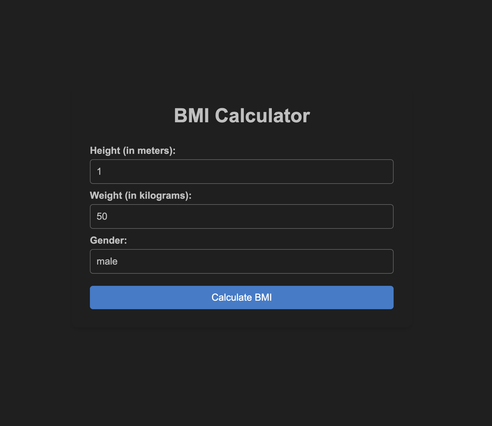
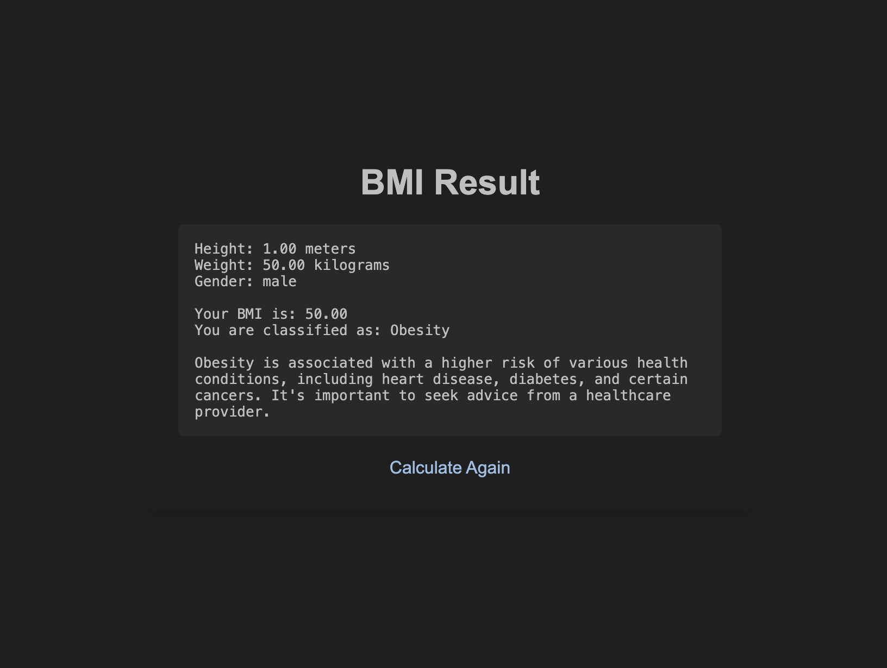

# BMI Calculator

A simple web application to calculate Body Mass Index (BMI) based on user's height, weight, and gender. This application is built using Flask and provides a detailed report of the user's BMI category.

## Features

- Input fields for height, weight, and gender.
- Calculates BMI based on user inputs.
- Provides a detailed report categorizing BMI (Underweight, Normal weight, Overweight, Obesity).
- Responsive and user-friendly interface.

## Installation

### Prerequisites

- Python 3.x installed on your machine.
- Flask installed in your virtual environment.

### Setup

1. **Clone the repository:**
   ```bash
   git clone https://github.com/yourusername/bmi-calculator.git
   cd bmi-calculator
   ```

2. **Create a virtual environment:**
   ```bash
   python -m venv strong
   ```

3. **Activate the virtual environment:**

   - **Windows:**
     ```bash
     strong\Scripts\activate
     ```

   - **macOS/Linux:**
     ```bash
     source strong/bin/activate
     ```

4. **Install the required dependencies:**
   ```bash
   pip install -r requirements.txt
   ```

### Running the Application

1. **Start the Flask server:**
   ```bash
   python app.py
   ```

2. **Open your web browser and go to:**
   ```
   http://127.0.0.1:5000/
   ```

## Usage

1. Enter your height (in meters), weight (in kilograms), and gender in the input fields.
2. Click on the "Calculate BMI" button.
3. View your BMI result and category in the detailed report.

## Project Structure

```
bmi-calculator/
├── app.py
├── templates/
│   ├── index.html
│   ├── result.html
├── static/
│   ├── style.css
├── .gitignore
├── requirements.txt
└── README.md
```

## Screenshots

### Home Page


### Result Page


## License

This project is licensed under the MIT License. See the [LICENSE](LICENSE) file for more details.

## Contributing

Contributions are welcome! Please fork this repository and submit a pull request for any improvements or bug fixes.

## Acknowledgements

- Flask: [Flask Documentation](https://flask.palletsprojects.com/)
- Bootstrap: [Bootstrap Documentation](https://getbootstrap.com/)

---

Feel free to enhance the application with more features or improve the design. Happy coding!
